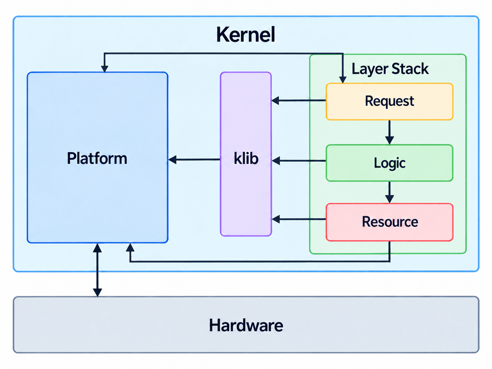

# Arx
Multiarch 64 bit Kernel in development

Targets:
- x86_64
- aarch64

## Design

Design in order of initialization

Platform
- Architecture specific initiliztion
- Sets up klib
- only part that accesses hardware directly

klib
- contains kernel stdlib
- only access platform for memory allocation functions (kmalloc/vmalloc)

Layer stack
- layers can only access the layer right bellow them using the layers import caps
- lower layers cannot access layers above
- protected by the fact the layers will only have caps struct of layers bellow them

Resource
- Kernel resource manager
- Manages any resources/objects that the kernel owns
- Accesses hardware via platform

Logic
- main logic of kernel
- gets hardware/kernel resources from resource layer
- decides what to do with resources

Request
- interface for kernel request from syscalls or interrupts

Dispatcher
- *not imaged
- how platform will access layer stack

### Platform Setup
- Limine Bootloader loads kernel and sets entry point to _start in arch_entry.c
- arch_entry processes Limine requests, formats it to fit Arx boot protocol in boot.h then passes it to kernel_bootstrap in bootstrap.c
- Arx boot protocol needs 
    - Memory map
    - Framebuffer 
    - Higher half direct memory
    - Paging with no user access and RWX 
    - ACPI rsdp address
    - SMP setup 
- kernel_bootstrap will initialize kernel subsystems

### Platform

- platform variable which stores important global and per cpu platform data structures
- Type is `platform_t` defined in `kernel/platform/platform.h`
- index by arch cpu id
- NOTE: In diagrams platform is named as Dispatcher

### Memory Management

Physical memory managment

- Zone is built from boot memory map
- Currently only one Numa node and zone but gives us space to scale into suporting Non Uniform Memory Access and different memory zones

Allocations | pmm_alloc(size)

Frees | pmm_free(addr)

Virtual memory managment
- page table managment apis (map/unmap/protect)
- each arch implements paging api
- x86_64 paging uses a shared page-table walker for map/unmap/protect on both single-page and range paths
    - keeps page-table traversal behavior consistent across operations
    - range functions batch work to avoid redundant table walks and reduce flush overhead
- smp sync on x86_64 includes TLB shootdown for CPUs running the same active page table
    - local core performs invlpg or non-global CR3 reload depending on change type
    - remote cores receive an IPI request with typed request data (single-page or range invalidation)
- vmm paging apis are wrappers over arch specific implmentation that lock on address space

Virtual address space management
- uses canonical addressing
- on vmm init we init the initial address space by subtracting hhdm, framebuffer, and kernel form the kernel address space

Virtual address space structure

Reserve region in address space

Free region in address space

Heap structure

Heap Alloc

Heap Free

    
Klib allocations
- vmalloc and vfree
    - uses pmm and vmm api to allocate large contiguous virtual memory chunks
    - slow due to needing to map pages
- kmalloc, kzalloc, kfree
    - uses heap api to allocate fast small blocks of contiguous memory
    - fast due to not needing to map pages

### SMP init
- Limine provides SMP cpu list and bsp id through the boot info
- BSP runs arch_smp_init(boot_info) after base kernel init in kernel_bootstrap
- arch_smp_init walks all cpus and skips the BSP
- each AP gets goto_address = smp_entry set from its Limine SMP record
- AP enters smp_entry and then calls smp_kmain
- smp_kmain runs per-core arch init

### Arch Init
ran on each smp core
- x86_64
    - build and install 64 bit GDT for kernel and user segments including a TSS
    - initialize per cpu TSS rsp0/ist1 and io bitmap base for user -> kernel transitions
    - initialize per cpu syscall msrs (efer.sce, star, lstar, fmask, kernel gs base)
    - expose arch_enter_user_mode to iretq into cpl3 using user cs/ss and controlled rflags
    - syscall entry path switches from user rsp to per cpu kernel syscall stack then dispatches
    - build and install IDT all isrs call a common isr handler and jumps to c code ISRHANDLER passing regs
    - get madt from acpi using uacpi (bsp only)
    - get per core lapic info from madt
    - init lapic per core
    - init per core lapic timer
    - init global ioapic on bsp only (masking all entries)
    - get iso overides from madt
    - route legacy irqs to bsp lapic
    - expose api to mask/unmask vectors, register new vectors, and route vectors
- General
    - set cpu stack and jump to kernel_bootstrap_complete

### Post Platform Init
currently all cores wait for the rest of the cores to enter post init then continue.

## Kernel Software Stack
- Resource
    - Task manager
        - Manages schedulable execution units called tasks
        - Creation and Allocation
        - Deletion and Clean up
    - Process manager
        - Manages Process abstractions
        - Creation and Allocation
        - Deletion and Clean up
- Logic
- Request

### Virtual Filesystem Layering
- Resource owns concrete filesystem backends and exposes them through `ResourceLayerFileSystemCaps`
    - `MountFilesystem`
    - `GetRootNode`
    - `GetNodeInfo`
    - `Lookup`
    - `Read`
    - `Write`
- Resource backend objects are opaque handles (`resource_fs_t`, `resource_node_t`) and are not VFS objects.
- Logic/VFS wraps backend handles into VFS objects (`filesystem_t`, `inode_t`, `dentry_t`, `mount_t`, `file_t`) and gives them Unix-style semantics.

Startup mount flow:
1. `Dispatcher::StartKernel()` creates Resource and Logic layers.
2. Logic VFS mounts root via `MountRootFileSystem("cpio", initRamFileSystemManager)`.
3. Resource returns backend filesystem and root node handles.
4. Logic creates root inode/dentry/mount and installs root namespace mount.

Current backend:
- `cpio` through `ResourceFileSystem` using initramfs data provided by platform boot info.

VFS flow diagram:
- see `docs/DIAGRAMS.md` for `VFS Mount and Open Flow`.

## Processes
- Tasks
    - unit of schedulable cpu execution
    - contain stack and task function
    - holds cpu context
- Process
    - stores tasks part of process
    - storess address space

## Third Party
- [Limine](https://github.com/limine-bootloader/limine) - Bootloader/protocol used to load the kernel and provide boot info.
- [printf](https://github.com/mpaland/printf) - Small freestanding printf implementation used for kernel logging output.
- [uACPI](https://github.com/uACPI/uACPI) - ACPI implementation used for table parsing and ACPI support.
- [Flanterm](https://github.com/Mintsuki/Flanterm) - fast and reasonably complete terminal emulator

All third-party components retain their original licenses.

## AI Usage
- Build system and scripts are AI generated
- selftest.c is AI generated testing of kernel subsystems
- Ai used for refactoring and codebase managment
