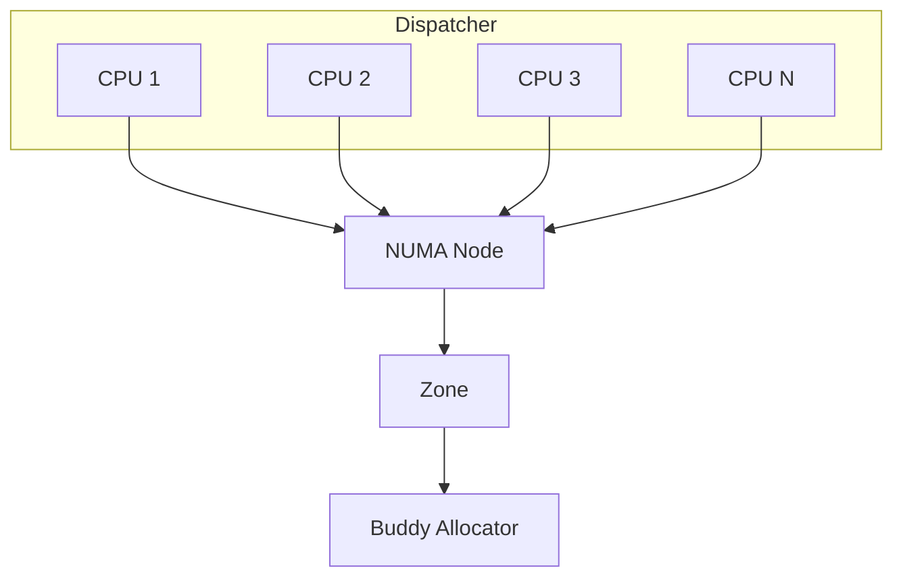
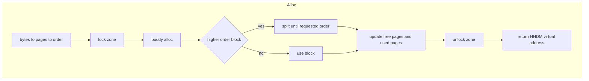
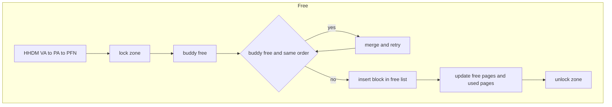

# Diagrams

```mermaid
graph TD

    subgraph Dispatcher
        CPU1[CPU 1]
        CPU2[CPU 2]
        CPU3[CPU 3]
        CPUN[CPU N]
    end

    CPU1 --> NUMA
    CPU2 --> NUMA
    CPU3 --> NUMA
    CPUN --> NUMA

    NUMA[NUMA Node]
    NUMA --> ZONE[Zone]
    ZONE --> BUDDY[Buddy Allocator]
```

```mermaid
flowchart TD
    subgraph Alloc
        K[bytes to pages to order] --> L[lock zone]
        L --> M[buddy alloc]
        M --> N{higher order block}
        N -- yes --> O[split until requested order]
        N -- no --> P[use block]
        O --> Q[update free pages and used pages]
        P --> Q
        Q --> R[unlock zone]
        R --> S[return HHDM virtual address]
    end
```

```mermaid
flowchart TD
    subgraph Free
        T[HHDM VA to PA to PFN] --> U[lock zone]
        U --> V[buddy free]
        V --> W{buddy free and same order}
        W -- yes --> X[merge and retry]
        W -- no --> Y[insert block in free list]
        X --> W
        Y --> Z[update free pages and used pages]
        Z --> AA[unlock zone]
    end
```

