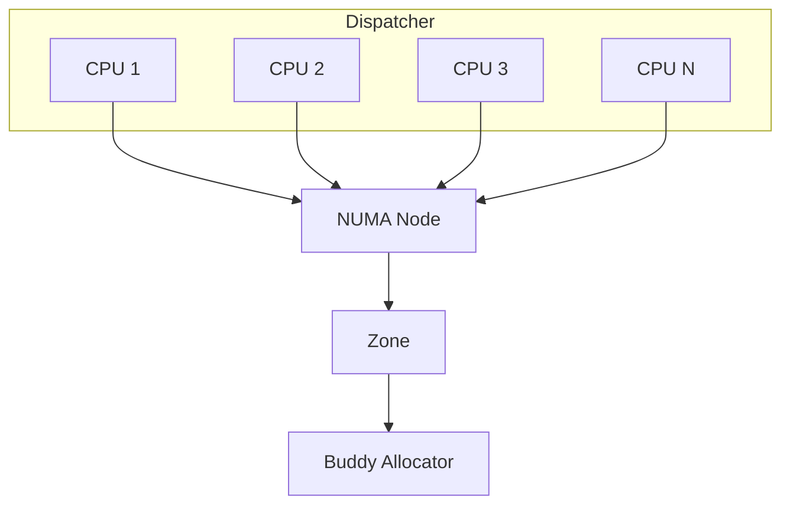
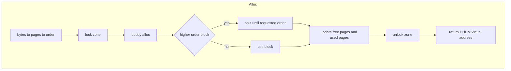
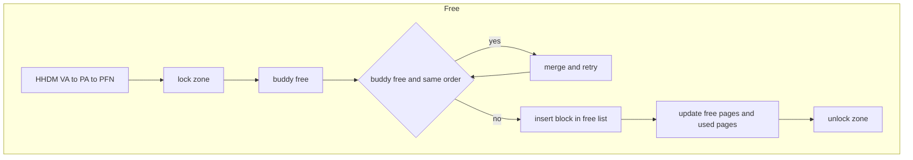
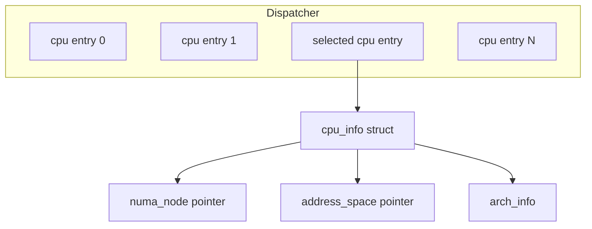
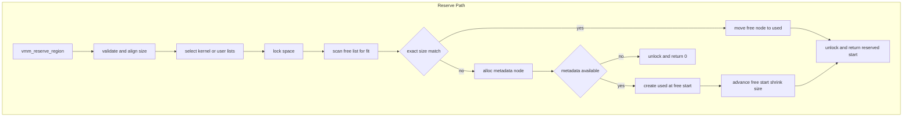
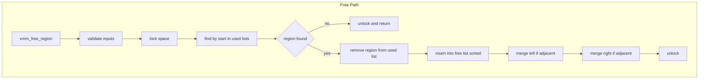
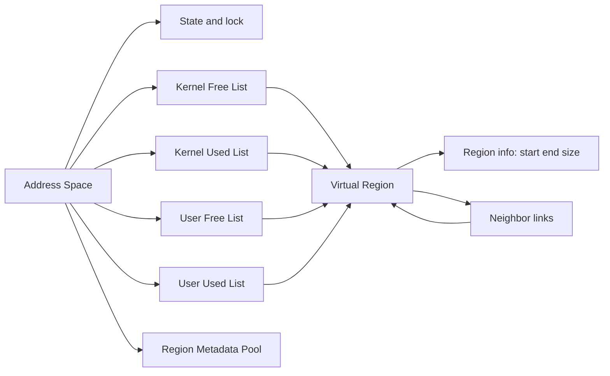

# Diagrams

```mermaid
graph TD

    subgraph Dispatcher
        CPU1[CPU 1]
        CPU2[CPU 2]
        CPU3[CPU 3]
        CPUN[CPU N]
    end

    CPU1 --> NUMA
    CPU2 --> NUMA
    CPU3 --> NUMA
    CPUN --> NUMA

    NUMA[NUMA Node]
    NUMA --> ZONE[Zone]
    ZONE --> BUDDY[Buddy Allocator]
```

```mermaid
flowchart TD
    subgraph Alloc
        K[bytes to pages to order] --> L[lock zone]
        L --> M[buddy alloc]
        M --> N{higher order block}
        N -- yes --> O[split until requested order]
        N -- no --> P[use block]
        O --> Q[update free pages and used pages]
        P --> Q
        Q --> R[unlock zone]
        R --> S[return HHDM virtual address]
    end
```

```mermaid
flowchart TD
    subgraph Free
        T[HHDM VA to PA to PFN] --> U[lock zone]
        U --> V[buddy free]
        V --> W{buddy free and same order}
        W -- yes --> X[merge and retry]
        W -- no --> Y[insert block in free list]
        X --> W
        Y --> Z[update free pages and used pages]
        Z --> AA[unlock zone]
    end
```

```mermaid
graph TD

    subgraph Dispatcher
        CPU1[cpu entry 0]
        CPU2[cpu entry 1]
        SLOT[selected cpu entry]
        CPUN[cpu entry N]
    end

    SLOT --> CPU[cpu_info struct]
    CPU --> NUMA[numa_node pointer]
    CPU --> VAS[address_space pointer]
    CPU --> ARCH[arch_info]
```

```mermaid
flowchart TD

    subgraph Reserve Path
        R0[vmm_reserve_region] --> R1[validate and align size]
        R1 --> R2[select kernel or user lists]
        R2 --> R3[lock space]
        R3 --> R4[scan free list for fit]
        R4 --> R5{exact size match}
        R5 -- yes --> R6[move free node to used]
        R5 -- no --> R7[alloc metadata node]
        R7 --> R8{metadata available}
        R8 -- no --> R9[unlock and return 0]
        R8 -- yes --> R10[create used at free start]
        R10 --> R11[advance free start shrink size]
        R6 --> R12[unlock and return reserved start]
        R11 --> R12
    end

```

```mermaid
flowchart TD
    subgraph Free Path
        F0[vmm_free_region] --> F1[validate inputs]
        F1 --> F2[lock space]
        F2 --> F3[find by start in used lists]
        F3 --> F4{region found}
        F4 -- no --> F5[unlock and return]
        F4 -- yes --> F6[remove region from used list]
        F6 --> F7[insert into free list sorted]
        F7 --> F8[merge left if adjacent]
        F8 --> F9[merge right if adjacent]
        F9 --> F10[unlock]
    end
```

```mermaid
flowchart LR
    A[Address Space]
    B[State and lock]
    C[Kernel Free List]
    D[Kernel Used List]
    E[User Free List]
    F[User Used List]
    G[Region Metadata Pool]
    H[Virtual Region]
    I[Region info: start end size]
    K[Neighbor links]

    A --> B
    A --> C
    A --> D
    A --> E
    A --> F
    A --> G

    C --> H
    D --> H
    E --> H
    F --> H

    H --> I
    H --> K
    K --> H
```

